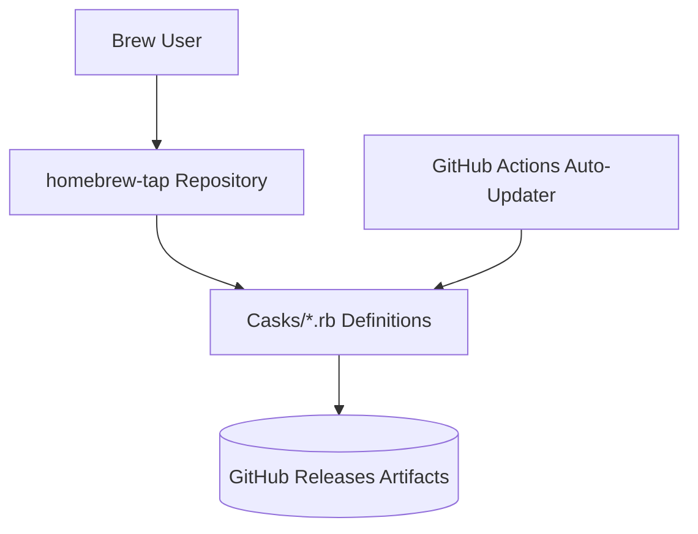

# System architecture

```mermaid
graph TD
    User[Brew User] --> Tap[homebrew-tap Repository]
    Tap --> Casks[Casks/*.rb Definitions]
    CI[GitHub Actions Auto-Updater] --> Casks
    Casks --> Binaries[(GitHub Releases Artifacts)]
```
