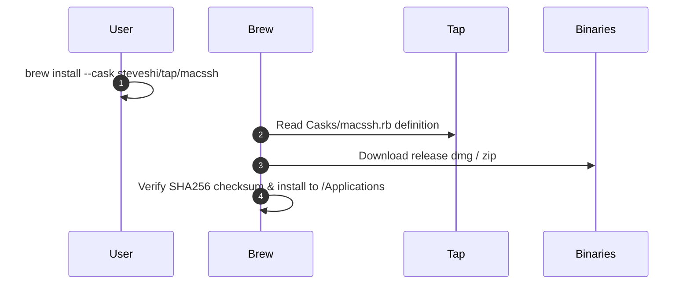

# Key flows

```mermaid
sequenceDiagram
    autonumber
    User->>User: brew install --cask steveshi/tap/macssh
    Brew->>Tap: Read Casks/macssh.rb definition
    Brew->>Binaries: Download release dmg / zip
    Brew->>Brew: Verify SHA256 checksum & install to /Applications
```
